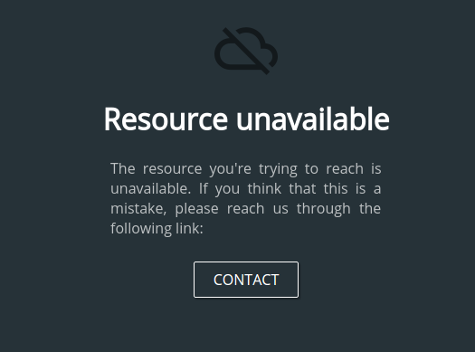

# Apache-Fallback-Page

This project allows you to serve a fancy page as an apache fallback vhost:

Besides its coolness, this adds a little more security since it makes you aware of which vhost will be served if apache
couldn't match any of your defined vhosts at first.

## Deploying this project
This project is compatible with [Simple-Deployment-Script](https://github.com/chteuchteu/Simple-Deployment-Script). See 
[Symfony 2 & 3 notes](https://github.com/chteuchteu/Simple-Deployment-Script#symfony-2-and-3) if you need some help on
deploying this project to your web server. Don't miss the [scss pass](https://github.com/chteuchteu/Simple-Deployment-Script#scss-pass)
part.

Once done, create an apache vhost matching this project, or customize the usually unused `default.conf` or `000-default.conf`
vhost file in `/etc/apache2/sites-available/` directory. You should not set neither `ServerName` nor `ServerAlias` directives
to let apache use it as the default vhost:

	<VirtualHost *:80>
		DocumentRoot /var/www/Apache-Fallback-Page/web/
		<Directory "/var/www/Apache-Fallback-Page/web/">
			DirectoryIndex app.php
			Options -Indexes FollowSymLinks
			AllowOverride All
			RewriteEngine On
			RewriteCond %{REQUEST_FILENAME} !-f
			RewriteRule ^(.*)$ app.php [QSA,L]
		</Directory>

		ErrorLog ${APACHE_LOG_DIR}/error.log
		LogLevel warn
		CustomLog ${APACHE_LOG_DIR}/access.log combined
	</VirtualHost>

The tricky part is to make this vhost the default one: when running the `apache2ctl -S` command, your newly created vhost
should appear as the first item of the list (`default server`):

    root@my_hostname:~# apache2ctl -S
    VirtualHost configuration:
    wildcard NameVirtualHosts and _default_ servers:
    *:80                   is a NameVirtualHost
             default server my_hostname (/etc/apache2/sites-enabled/000-default:1)
             port 80 namevhost my_hostname (/etc/apache2/sites-enabled/000-default:1)

### Third-party services vhosts order conflicts
Other services may appear as the first one: `phpMyAdmin` or `munin` may. Unfortunately, there's no perfect way
to tell apache which vhost should be chosen as fallback, since their vhost configuration file usually lives in another
directory. The easy solution would be to remove occurrences to these in apache conf files and to symlink those from
the `/etc/apache2/sites-available/` directory. Don't forget to `a2ensite` the latter.

### Localhost access
Please remind that this vhost will be served when you'll try to visit `localhost` from your server. Some services may rely
on this behavior, so we need to add some exceptions to our vhost. For instance, if you want to allow access to `/server-status`
from localhost, edit your vhost accordingly:

	<VirtualHost *:80>
    	<Location /server-status>
    	    SetHandler server-status
    	    Order deny,allow
    	    Deny from all
    	    Allow from 127.0.0.1 localhost
    	</Location>
    
    	RewriteEngine On
    	RewriteCond %{REQUEST_URI} /server-status
    	RewriteRule ^ - [L]
    
    	DocumentRoot /var/www/Apache-Fallback-Page/web/
    	<Directory "/var/www/Apache-Fallback-Page/web/">
    		DirectoryIndex app.php
    		Options -Indexes FollowSymLinks
    		AllowOverride All
    		RewriteEngine On
    		RewriteCond %{REQUEST_URI} !^/server-status$
    		RewriteCond %{REQUEST_FILENAME} !-f
    		RewriteRule ^(.*)$ app.php [QSA,L]
    	</Directory>
    </VirtualHost>

You can use `lynx` (a command-line browser) to test your vhost configuration.
